# Top 28 Large File Transfer Services in 2025 (Latest Updated)

Sending a 10GB video file to a client shouldn't feel like launching a rocket into space, but here we are in 2025, still wrestling with email attachment limits and wondering why our files are taking forever to upload. Whether you're a creative professional shipping raw footage, a business team collaborating across continents, or just someone who needs to send more than three photos without compression artifacts, the right file transfer service makes all the difference between smooth sailing and digital frustration.

The landscape has shifted dramatically from the early days when we'd compress files into seventeen parts and pray they'd all arrive intact. Today's services handle everything from quick 2GB transfers to massive terabyte-scale movements, with security features that would make your IT department nod approvingly.

## **[Filemail](https://filemail.com)**

Send files up to 5GB free without registration, or go unlimited with business plans designed for professionals who move serious data.

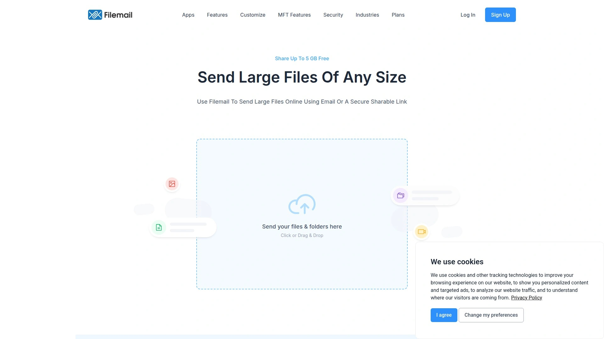

Filemail tackles the core problem that most services tiptoe around: truly unrestricted file sizes for paid users. The free tier already beats many competitors by allowing 5GB transfers with no account required, which is genuinely useful for quick one-off sends. What makes it stand out is the straightforward approach to both sending and receiving files—you get options for email delivery or shareable links, plus the ability to create custom upload pages where clients can send files directly to you.

For teams handling regular large transfers, the Business plan removes size limits entirely and throws in permanent file availability, meaning you can use it as both a transfer tool and a storage solution. The platform maintains compliance with major standards including GDPR, HIPAA, ISO27001, and SOX, making it suitable for regulated industries. Desktop apps for Windows, Mac, and Linux include automatic downloads and transfer resumption, so interrupted uploads don't mean starting over. The UDP transfer acceleration on paid plans pushes speeds beyond what standard protocols deliver, particularly valuable when you're moving hundreds of gigabytes regularly.

## **[WeTransfer](https://wetransfer.com)**

Simple drag-and-drop interface for quick file sharing, though recent ownership changes have added restrictions to the free service.

WeTransfer built its reputation on being almost absurdly simple—upload, add recipient emails, send. That ease remains, but the 2024 acquisition by Bending Spoons brought changes that shifted the value proposition. The free version now caps transfers at 3GB with a 10-transfer monthly limit and 3-day link validity. You'll also encounter ads during uploads, and a newer restriction forces you to stay on the page until uploads complete. For occasional personal use with smaller files, it still works fine. The paid plans expand capabilities significantly with larger sizes and longer storage periods. The interface stays clean and approachable, which explains why it remains popular despite tighter free-tier limitations.

## **[Smash](https://fromsmash.com)**

French-built alternative offering unlimited file sizes on the free plan with no transfer caps and zero advertising.

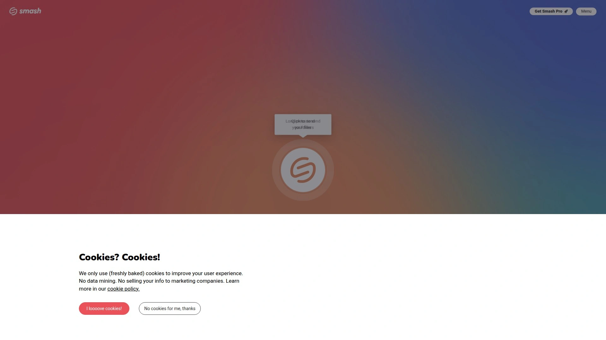

Smash positions itself as the ethical alternative in a market where free services usually come with catches. The free tier genuinely allows unlimited file sizes—though transfers over 2GB enter a queue—with no monthly limits, no recipient restrictions, and links valid for 7 days. No ads interrupt your experience, and uploads continue in the background even if you close the browser tab. The company emphasizes that files remain user property and aren't used for AI training, addressing privacy concerns that matter to many users. Upload speeds are competitive, handling 2GB in roughly 1.2 minutes on gigabit connections. Paid plans extend to 250GB per transfer with 1TB storage at reasonable annual rates. The interface mirrors WeTransfer's simplicity while delivering more generous terms.

## **[SendGB](https://www.sendgb.com)**

No-queue unlimited transfers on the free tier with unique file extension features that competitors don't offer.

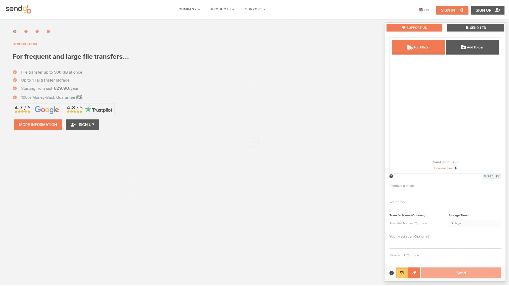

SendGB's standout feature is allowing free unlimited-size transfers without queuing delays that plague some competitors. Both free and paid users can extend download periods significantly, with free users able to push availability out to a year—something Smash and many others don't provide. The Exceed feature on paid tiers lets you send files up to 1TB for a small one-time fee without subscription commitments, perfect for occasional massive transfers. Security basics like password protection and download notifications are included free. The interface looks somewhat dated compared to newer services, but functionality trumps aesthetics when you need reliable delivery.

## **[TransferNow](https://www.transfernow.net)**

Straightforward French service with 5GB free transfers and strong tracking features for monitoring file downloads.

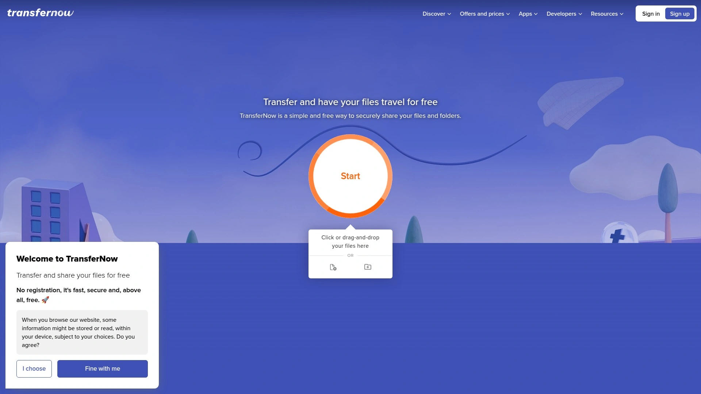

TransferNow keeps things simple while offering solid capacity at no cost—5GB per transfer without mandatory registration. The platform provides both email sending and shareable link generation, with real-time notifications when recipients download your files. Free users can add password protection, and the service uses AES 256-bit encryption with SSL/TLS 1.3 protocols for transfer security. Paid accounts bump capacity to 250GB per transfer with files available for up to 365 days, plus dashboard features for managing and re-sending transfers without re-uploading. The interface stays intuitive across desktop and mobile, making it accessible for users who aren't technical. Speed performance handles medium-large files efficiently, placing it in the reliable middle tier for both personal and professional use.

## **[Send Anywhere](https://send-anywhere.com)**

Cross-platform direct device transfers using secure 6-digit keys, bypassing cloud storage entirely.

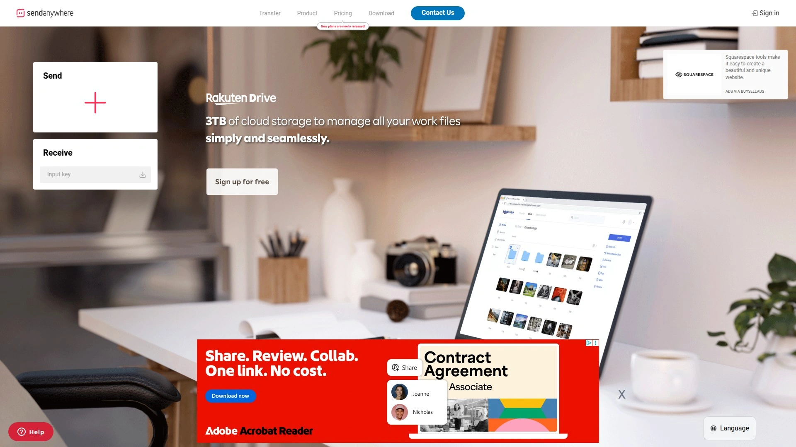

Send Anywhere takes a different approach by enabling peer-to-peer transfers between devices without cloud intermediaries. You generate a secure 6-digit key, share it with your recipient, and files move directly between devices. This method works across platforms—Windows, Mac, Linux, iOS, Android—making it versatile for mixed-device environments. The free version includes a 10GB transfer limit with ad support. File sizes are technically unlimited, and since there's no cloud storage involved, privacy-conscious users appreciate the direct approach. The interface requires slightly more user action than simple upload-and-share services, but the security model and cross-platform support make it worthwhile for tech-comfortable users who value direct transfers.

## **[Google Drive](https://drive.google.com)**

Deeply integrated with Google Workspace, offering 15GB free storage with strong collaboration features.

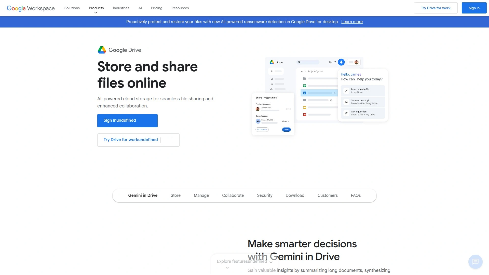

Google Drive serves dual purposes as both storage and sharing platform, with 15GB free across Gmail, Drive, and Photos. Sharing files involves uploading to your storage then generating links with customizable permissions—view, comment, or edit access. The tight integration with Google Docs, Sheets, and Slides enables real-time collaboration that standalone transfer services can't match. For businesses already using Google Workspace, the experience is seamless. Security includes two-factor authentication and sharing controls, though the free storage fills quickly with high-resolution media. Paid Google One plans expand storage substantially. The platform works best for ongoing collaboration rather than quick one-off transfers, and the 15GB shared across services means large media files consume space rapidly.

## **[Dropbox](https://dropbox.com)**

Pioneer cloud storage service with robust syncing, strong encryption, and mature desktop applications.

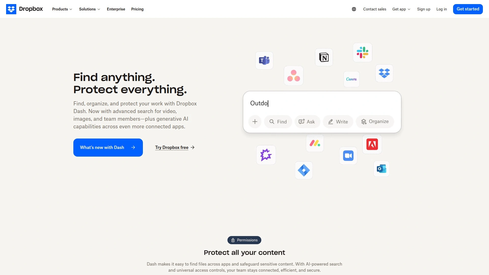

Dropbox established many conventions that other services follow, with reliable syncing across devices and straightforward sharing via links. The free plan provides 2GB storage, limiting it for large file transfers, but paid plans scale to unlimited storage with advanced features. File sharing includes password protection, expiration dates, and download notifications. The desktop apps offer offline access and automatic syncing, making it function more like extended local storage. Security uses SSL encryption and 256-bit AES protection. Integration with Microsoft Office, Slack, Zoom, and hundreds of other tools makes it powerful for teams with established workflows. The cost-to-storage ratio becomes steep for individuals, but businesses benefit from the mature admin controls and collaboration features.

## **[Microsoft OneDrive](https://onedrive.live.com)**

Windows-integrated storage with seamless Office 365 collaboration and strong individual file encryption.

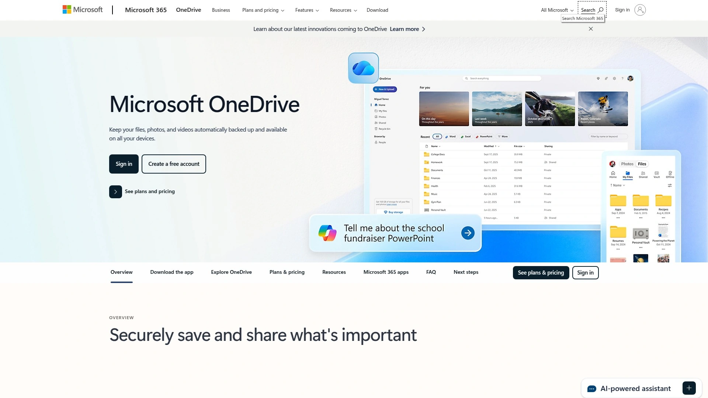

OneDrive leverages Microsoft's ecosystem dominance, particularly for Windows users where it integrates at the OS level. Free accounts get 5GB storage, while Microsoft 365 subscriptions include 1TB per user. File sharing works through links with permission controls, and the real-time collaboration with Word, Excel, and PowerPoint documents is smooth. Security features include two-factor authentication and individual file encryption options. For organizations already using Microsoft 365, adding OneDrive costs nothing extra and maintains familiar interfaces. The mobile apps handle file access well, and the offline sync functionality means you can work without connectivity. Upload speeds are competitive, and the platform scales effectively for both personal and enterprise use.

## **[Box](https://box.com)**

Enterprise-focused platform with granular permissions and extensive third-party integrations, ideal for regulated industries.

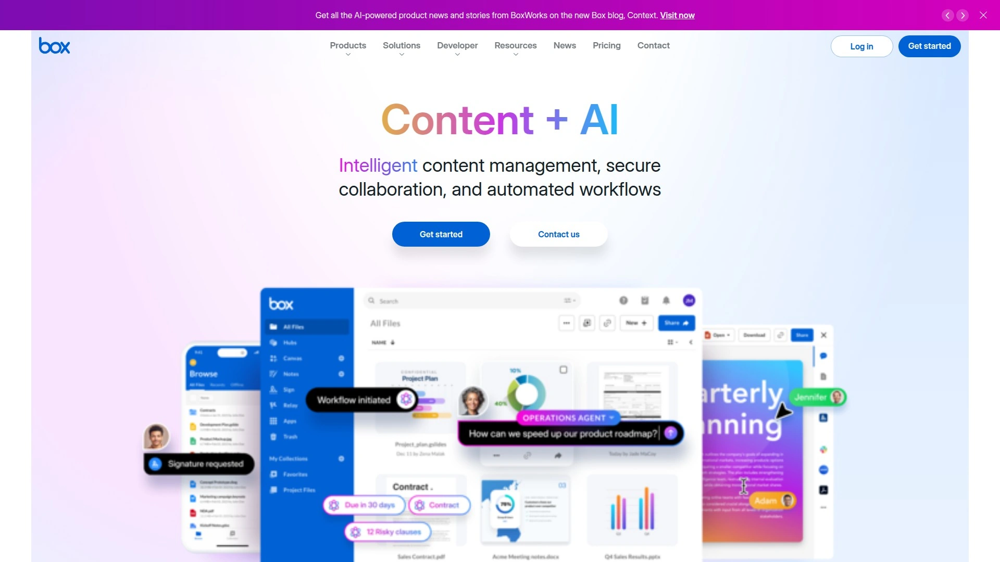

Box targets business users with advanced admin controls, workflow automation, and compliance features. The free tier offers 10GB storage with 250MB file size limits—restrictive for large media but workable for documents. Sharing includes password protection and expiration dates, with more granular folder permissions than many competitors. Integration with Google Workspace, Slack, and over 1,500 third-party apps makes it powerful for established business environments. Security meets compliance standards for HIPAA, FINRA, and other regulations, positioning it for healthcare, finance, and legal sectors. The interface prioritizes functionality over simplicity, requiring more setup than consumer-focused services. Paid plans remove size restrictions and add AI-powered file management features.

## **[Sync.com](https://sync.com)**

Zero-knowledge encrypted cloud storage from Canada with strong privacy focus and end-to-end encryption on shared files.

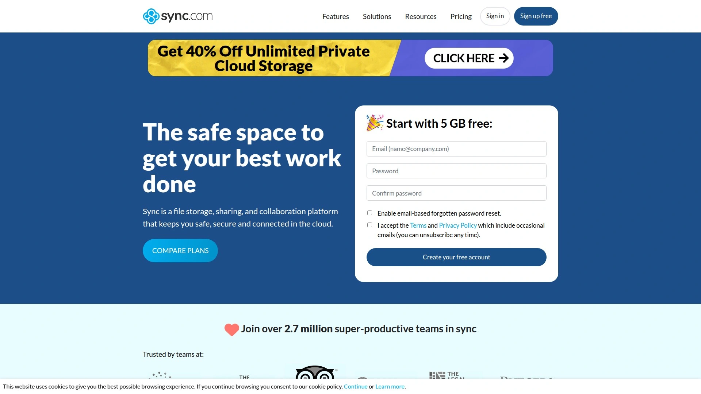

Sync.com differentiates through privacy-first architecture with zero-knowledge encryption—even Sync.com can't access your files. Free accounts get 5GB storage, and sharing works via encrypted links with customizable access controls for viewing, editing, commenting, and downloading. You can set expiration dates, revoke access, and password-protect shares while maintaining end-to-end encryption. The interface makes these security features accessible without technical expertise. Desktop and mobile apps sync reliably across platforms. For teams, centralized folders enable collaboration with complete oversight. Paid plans scale to multiple terabytes at competitive rates. The Canadian jurisdiction appeals to users seeking alternatives to US-based services. Speed performance is solid, and the privacy model attracts users handling sensitive materials.

## **[pCloud](https://pcloud.com)**

Swiss cloud storage with client-side encryption options and lifetime purchase plans alongside subscriptions.

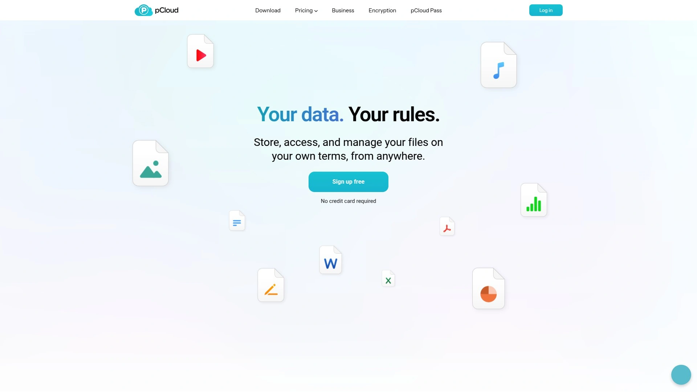

pCloud offers both subscription and one-time lifetime purchase options—unusual in a subscription-dominated market. Free accounts include 10GB storage, and the service delivers fast upload and download speeds consistently. File sharing via links includes password protection and expiration settings. The optional Crypto add-on provides client-side encryption for users wanting zero-knowledge security. Swiss data protection laws add jurisdictional privacy appeal. The interface is clean and responsive across web, desktop, and mobile platforms. The file versioning feature lets you recover previous file versions, and pCloud Rewind can restore your entire account to a specific point in time. For users wanting to escape recurring subscriptions, the lifetime plans represent long-term value despite higher upfront costs.

## **[Tresorit](https://tresorit.com)**

End-to-end encrypted Swiss service with stringent security standards, designed for businesses handling sensitive information.

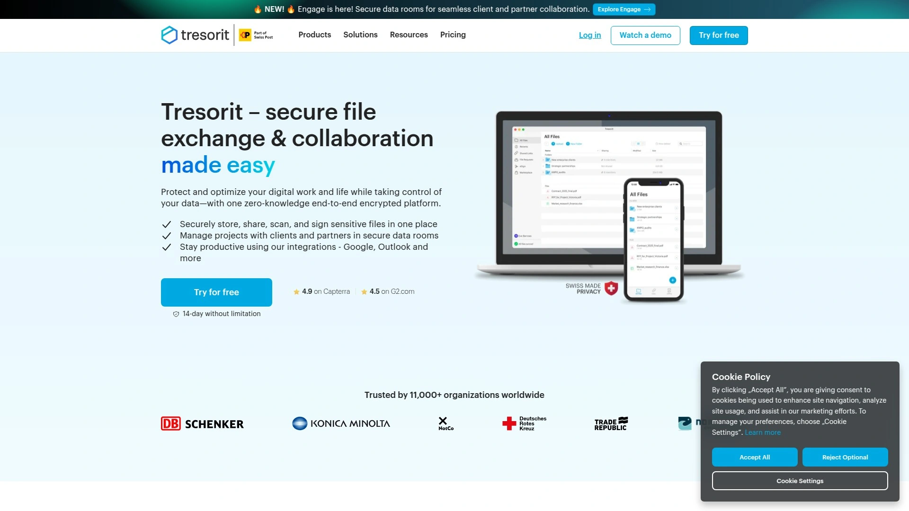

Tresorit builds everything around end-to-end encryption with data stored in European Microsoft Azure datacenters under GDPR compliance. Files remain encrypted from device to destination, with only you and recipients able to access content. The Content Shield features control external collaboration by restricting downloads, adding watermarks, and limiting file access. Security-conscious industries like legal, healthcare, and finance use Tresorit for client file exchanges. The interface balances security with usability, though it's more complex than simpler transfer services. Speeds are competitive despite the encryption overhead. Plans are premium-priced reflecting the enterprise-grade security model. For teams where data breaches would be catastrophic, the cost-to-protection ratio makes sense.

## **[MEGA](https://mega.nz)**

New Zealand-based cloud storage with generous 20GB free tier and end-to-end encryption across all files.

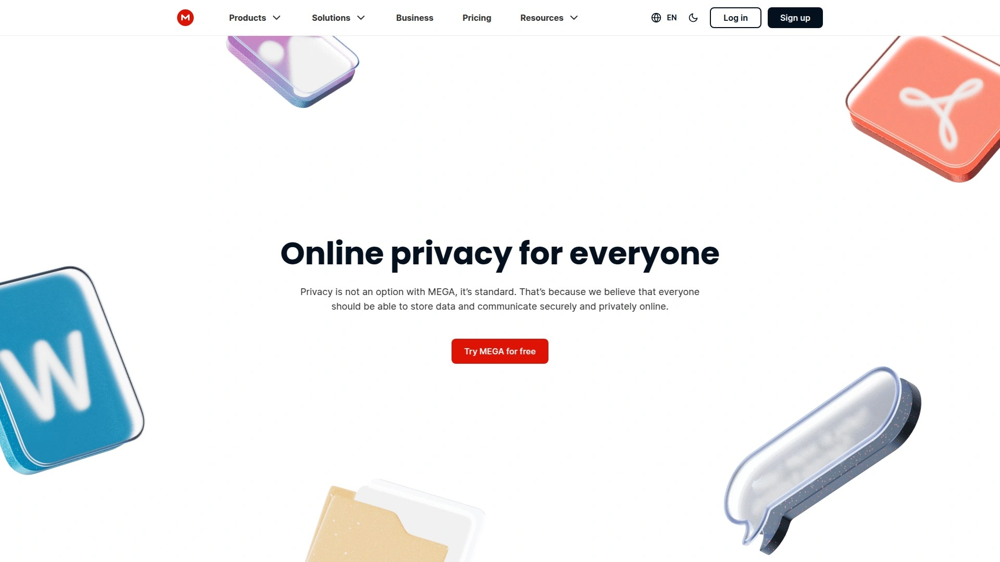

MEGA provides 20GB free storage with end-to-end encryption standard across all accounts—more generous than most competitors. File sharing happens through encrypted links, and the service includes secure chat features for coordinating transfers. Paid plans scale dramatically, with the top tier offering 16TB at reasonable monthly rates. The browser-based interface works without installations, though desktop and mobile apps are available. Upload and download speeds are solid, and the New Zealand jurisdiction offers privacy advantages. The platform lacks advanced collaboration features like real-time document editing, focusing instead on secure storage and sharing. For users wanting substantial free encrypted storage, MEGA delivers excellent value.

## **[Internxt](https://internxt.com)**

Privacy-focused open-source platform with zero-knowledge architecture and free tools for security checking.

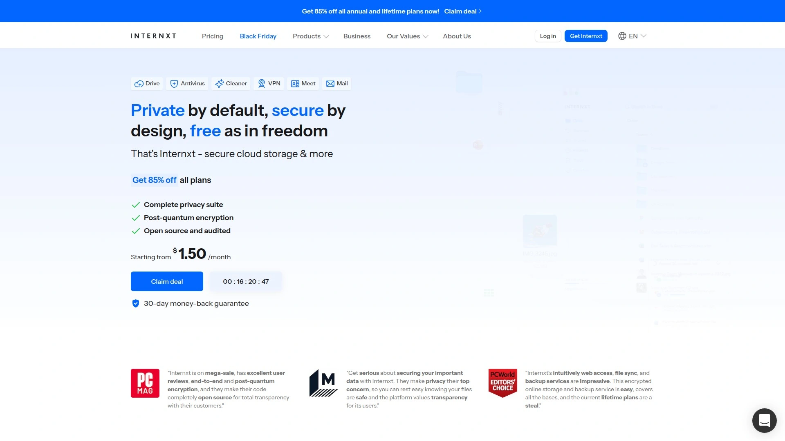

Internxt emphasizes user privacy through zero-knowledge encryption across all products. The free plan includes generous storage, and Internxt Send allows encrypting up to 5GB for free file transfers. Shared files remain encrypted in transit with controllable permissions, password protection, and access revocation. The open-source codebase allows security audits, building trust with privacy-conscious users. The interface is clean with dark mode support, and apps cover Windows, Mac, Linux, iOS, and Android. Free security tools like virus checkers and email breach monitors add value beyond basic file sharing. Real-time document collaboration isn't currently available, limiting it for teams needing simultaneous editing. For individuals prioritizing privacy over collaborative features, Internxt offers strong value.

## **[SwissTransfer](https://swisstransfer.com)**

Swiss-made free service allowing 50GB transfers with strong privacy protections and no account requirements.

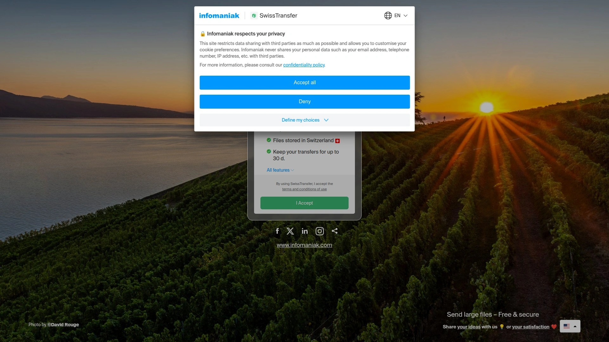

SwissTransfer delivers impressive capacity without registration—50GB per transfer completely free. The Swiss development and hosting provide jurisdictional privacy benefits under strict Swiss data protection laws. Files transfer securely with encryption, and the service maintains a clean interface without ads cluttering the experience. No account creation means quick access for urgent transfers. The straightforward approach mirrors WeTransfer's simplicity but with much larger capacity. Links remain valid for reasonable periods, and basic security features like password protection are included. For European users or those wanting Swiss privacy standards, it represents excellent value for occasional large transfers.

## **[Hightail](https://hightail.com)**

Creative collaboration platform combining file transfer with project management tools and visual feedback features.

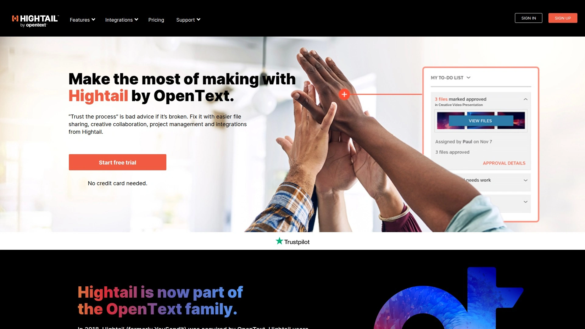

Hightail extends beyond simple transfer to include creative collaboration workflows. File sharing supports large media files with security options like access codes, automatic expiration, identity verification, and download receipts. The platform integrates project management elements, letting teams coordinate around files with comments and approvals. Integration with Dropbox and Google Drive allows pulling files from existing storage. The interface targets creative industries—video production, design, photography—where feedback loops around visual assets matter. Pricing reflects the extended feature set beyond basic transfer. Setup is more involved than simple send services, but teams managing creative projects benefit from the unified workflow.

## **[Jumpshare](https://jumpshare.com)**

Screen recording and file sharing hybrid with instant link generation and visual preview capabilities.

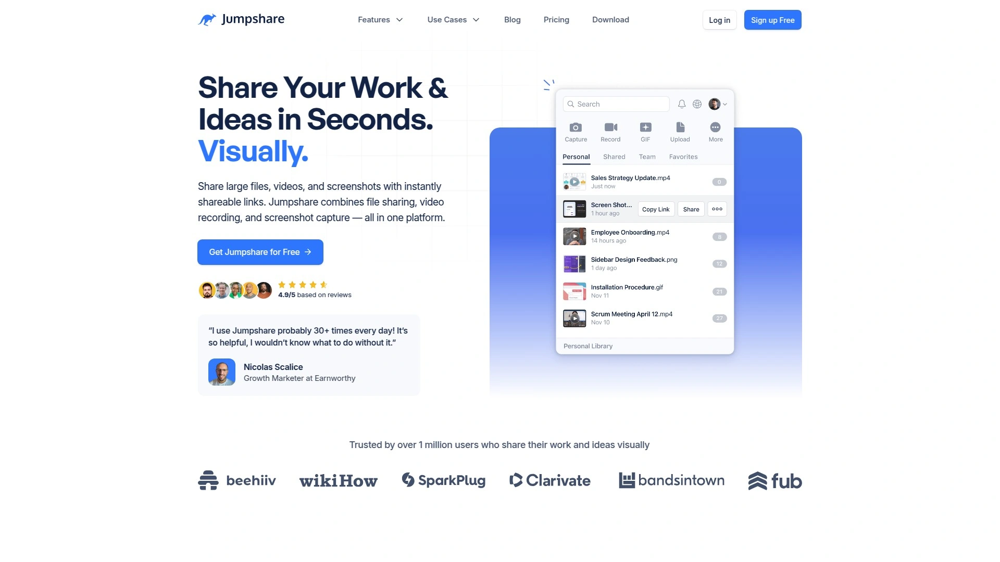

Jumpshare combines file sharing with screen recording and screenshot tools, creating a unique offering. File uploads generate instant shareable links, and the platform displays previews for images, videos, and documents without requiring downloads. The screen recording feature captures workflows or demonstrations, automatically generating shareable links. This makes it valuable for technical support, tutorials, or bug reporting where visual context matters. The free tier includes reasonable capacity, with paid plans expanding storage and features. The interface is fast and minimalist, prioritizing quick capture-and-share workflows. For users frequently sharing visual content with explanations, Jumpshare's hybrid approach saves switching between tools.

## **[Egnyte](https://egnyte.com)**

Hybrid cloud platform combining cloud and local storage with granular permissions for enterprise file management.

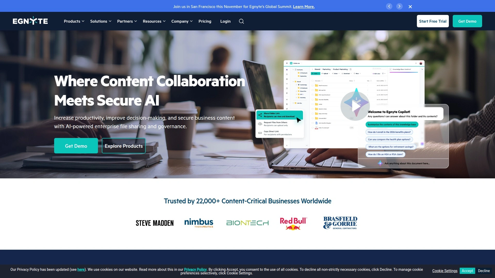

Egnyte serves enterprises needing both cloud flexibility and local storage control. The hybrid approach lets organizations keep sensitive data on-premises while using cloud for accessibility. Granular subfolder permissions provide detailed access control that consumer services lack. Integration with Microsoft 365, Google Workspace, and hundreds of business tools makes it powerful for established environments. AI-powered features include multi-document summarization and Q&A capabilities. Security includes ransomware detection, automated recovery, and compliance with various regulatory frameworks. Desktop apps provide drive letter access similar to local storage, easing user adoption. The platform scales for teams from small businesses to large enterprises, with pricing reflecting the enterprise feature set.

## **[ShareFile](https://sharefile.com)**

Enterprise document workflow platform with integrated e-signatures and automated approval processes.

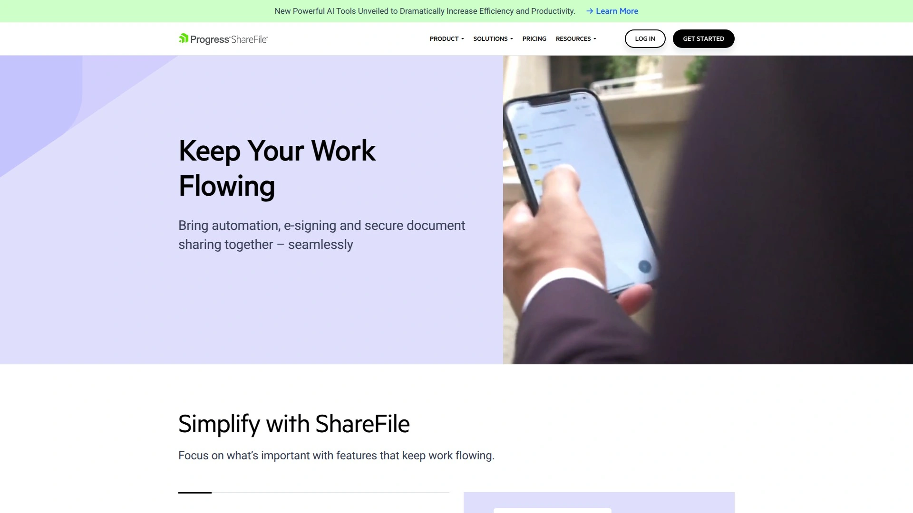

ShareFile targets professional services—legal, accounting, healthcare—with document-centric workflows. Beyond file sharing, it includes integrated e-signatures through RightSignature, automated approval processes, and customizable client portals. Encryption, two-step verification, and granular access controls meet regulatory requirements for sensitive industries. Integration with Microsoft 365, Google Workspace, QuickBooks, and Salesforce connects to existing business systems. The platform supports both cloud and on-premises deployment for organizations with specific data residency needs. File versioning, task management, and messaging tools create comprehensive collaboration environments. Setup complexity and cost position it for established businesses rather than individuals, but the unified workflow reduces tool fragmentation.

## **[Resilio Sync](https://resilio.com)**

Peer-to-peer synchronization using BitTorrent protocol for fast distributed file syncing without central cloud storage.

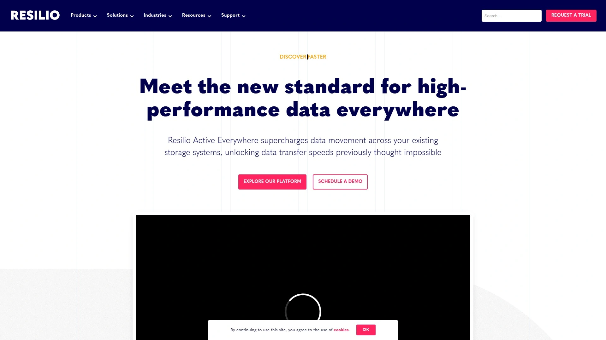

Resilio Sync uses BitTorrent technology for peer-to-peer file synchronization, avoiding centralized cloud storage. Files sync directly between devices, with transfer speeds increasing as more peers share the same data. This makes it exceptionally fast for large files across multiple locations—up to 100 times faster than hub-and-spoke architectures. The system works across platforms including laptops, NAS servers, and mobile devices. No file size limits exist since there's no cloud intermediary constraining capacity. The model requires all users to have Resilio installed and configured, creating more setup friction than simple cloud services. For organizations managing large distributed datasets or media production teams syncing extensive footage libraries, the speed and scalability advantages outweigh the complexity.

## **[MASV](https://massive.io)**

Media-focused transfer service optimized for video production with 10Gbps speeds and flexible pay-per-use pricing.

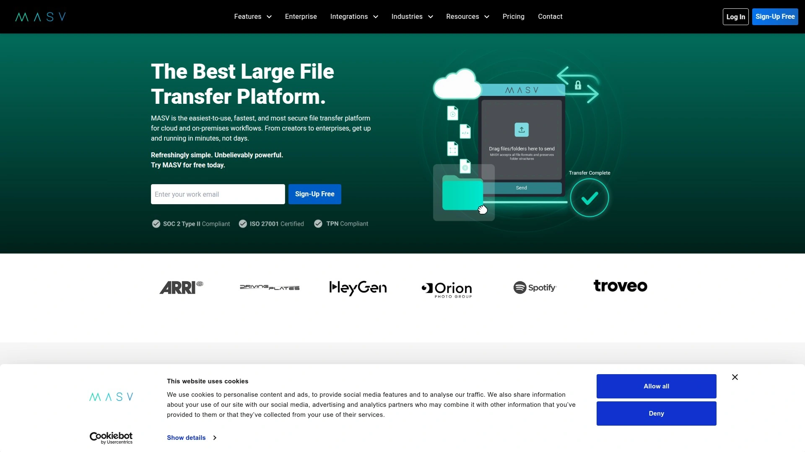

MASV specializes in massive video file transfers for media production workflows. The platform supports up to 10Gbps bandwidth, delivering some of the fastest ingest speeds available. Transfer resilience handles network interruptions without manual restarts, crucial for unreliable connections. Pay-per-use pricing means you're not locked into subscriptions—useful for project-based work with variable transfer volumes. Detailed transfer history provides compliance documentation and chain-of-custody tracking. The service integrates with production tools and platforms like LucidLink and Resilio Sync for automated workflows. Portal features let you collect files from clients who don't need MASV accounts. The focus on video production means features align with that industry's specific needs, though the specialization and pricing make it less suitable for general business use.

## **[IBM Aspera](https://ibm.com/products/aspera)**

Enterprise-grade high-speed transfer technology using proprietary FASP protocol, favored by media organizations globally.

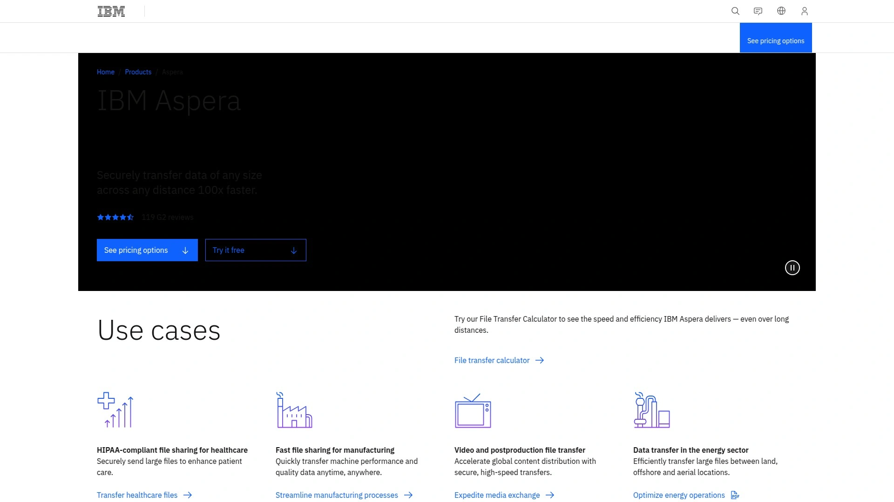

IBM Aspera uses patented FASP protocol to achieve maximum transfer speeds regardless of distance or network conditions. Organizations like Netflix, Disney, and Fox Sports rely on it for critical large-scale media transfers. The technology bypasses TCP limitations that slow traditional transfers, delivering predictable performance even across continents. End-to-end encryption maintains security at high speeds. Automation capabilities scale big data workflows, and integration with IBM Cloud enables hybrid cloud architectures. The platform includes over 200 plugins for connecting to existing applications. Setup and maintenance require technical expertise, and licensing costs reflect the enterprise positioning. For organizations where transfer speed directly impacts production schedules and revenue, Aspera's performance justifies the investment.

## **[FileCatalyst](https://filecatalyst.com)**

Accelerated UDP-based transfer solution handling millions of files and growing files during encoding.

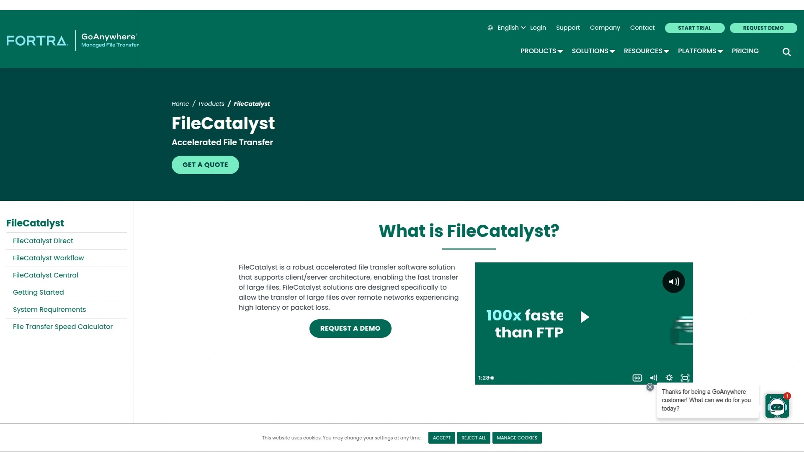

FileCatalyst uses UDP protocol with proprietary packet management to minimize data loss while maximizing speed. The platform handles millions of files efficiently, important for broadcast and media workflows with extensive asset libraries. A unique capability transfers growing files—like MXF files being encoded—delivering data as it's generated rather than waiting for completion. AES-256 encryption protects data in transit. The technology scales for cloud endpoints and traditional infrastructure. Setup requires more technical involvement than consumer services, and the interface appears dated compared to modern alternatives. Organizations in broadcast, post-production, and large-scale media distribution use FileCatalyst where transfer reliability and speed for complex workflows matter more than interface elegance.

## **[Kiteworks](https://kiteworks.com)**

Comprehensive secure collaboration platform with document tracking, watermarking, and extensive compliance capabilities.

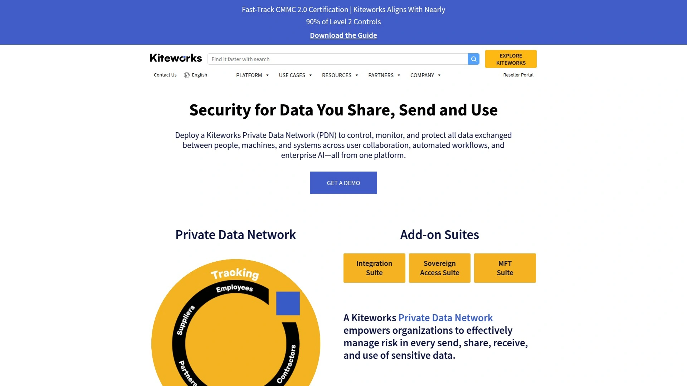

Kiteworks provides enterprise secure file sharing with advanced governance features. Document tracking monitors file access, watermarking identifies unauthorized distribution, and granular permissions control who can view, edit, or download. The platform scales across devices and platforms while maintaining centralized security policies. Compliance features address regulations across industries—GDPR, HIPAA, FINRA, and others. Real-time collaboration capabilities coexist with strict access controls, balancing usability and security. Integration with existing enterprise systems allows unified security policies across file transfer, email, and collaboration tools. The comprehensive feature set comes with complexity and cost appropriate for large organizations with demanding security requirements.

## **[SendBig](https://sendbig.com)**

Free service allowing 30GB with account registration and resumable uploads for recovery from connection issues.

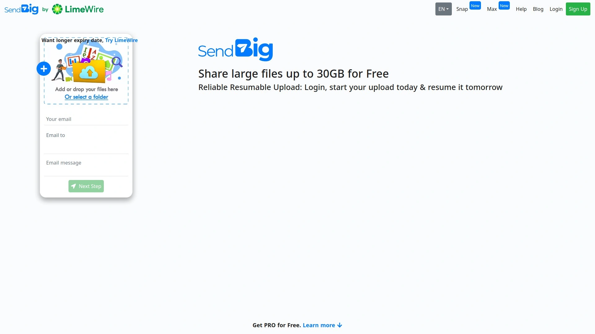

SendBig offers 5GB without registration and 30GB with a free account—generous capacity for no cost. Resumable uploads let you continue interrupted transfers without starting over, helpful for large files on unreliable connections. Security features include password protection and download limits per transfer. You can defer sending transfers up to three days, scheduling delivery for specific timing. The interface looks dated compared to modern services, and customer support response times receive criticism. No enterprise plans limit it to personal and small business use. For occasional large transfers where cost is the primary concern and interface aesthetics don't matter, SendBig delivers functional value.

## **[TitanFile](https://titanfile.com)**

Secure file exchange focused on compliance for regulated industries with detailed audit trails.

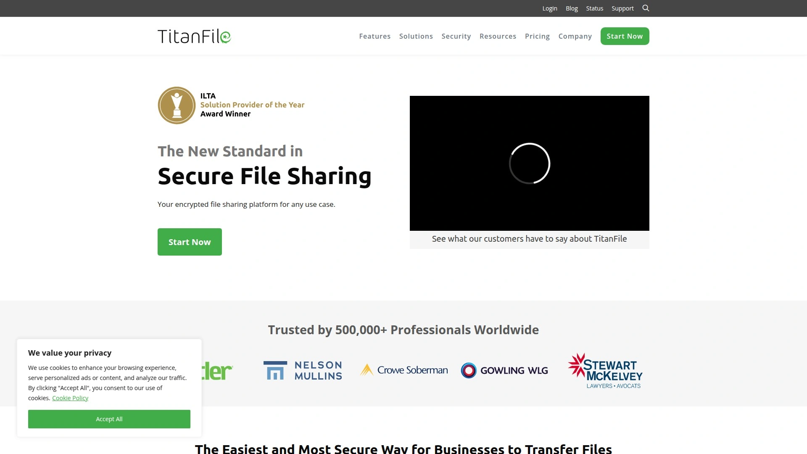

TitanFile targets industries with strict regulatory requirements—healthcare, legal, accounting, finance. The platform emphasizes compliance with detailed audit trails, access controls, and encryption meeting industry standards. Secure message exchange accompanies file transfers, keeping communication within the protected environment. Client portal features let external parties upload files securely without accounts. The system tracks who accessed what and when, providing documentation for compliance audits. Integration with existing workflows through APIs allows embedding secure transfer into business processes. Pricing reflects the compliance focus and enterprise features. The platform serves organizations where regulatory penalties for data breaches outweigh cost considerations.

## **[FileCloud](https://filecloud.com)**

Self-hosted or cloud file sharing with extensive customization and integration with existing infrastructure.

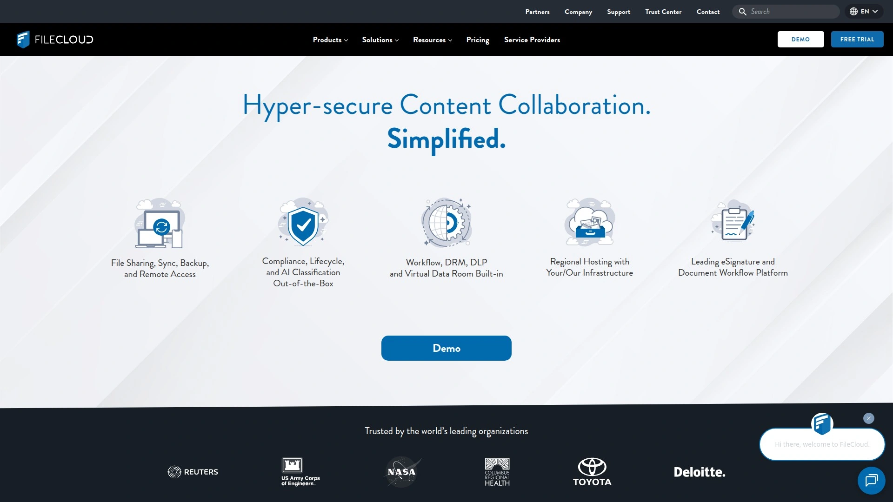

FileCloud offers both cloud-hosted and self-hosted deployment options, appealing to organizations wanting control over data location. The platform includes file sharing, syncing, and collaboration features with customizable interfaces. Integration with existing user directories and authentication systems simplifies user management in enterprise environments. Mobile and desktop apps provide access across devices. Admin controls enable detailed permissions and security policies. The self-hosted option requires IT resources for deployment and maintenance but provides maximum control. Cloud hosting simplifies management while maintaining feature parity. Pricing scales based on user count and deployment model. Organizations with specific compliance or data sovereignty requirements benefit from the deployment flexibility.

## **[SugarSync](https://sugarsync.com)**

Continuous synchronization service backing up and syncing any folder on your device, not just designated sync folders.

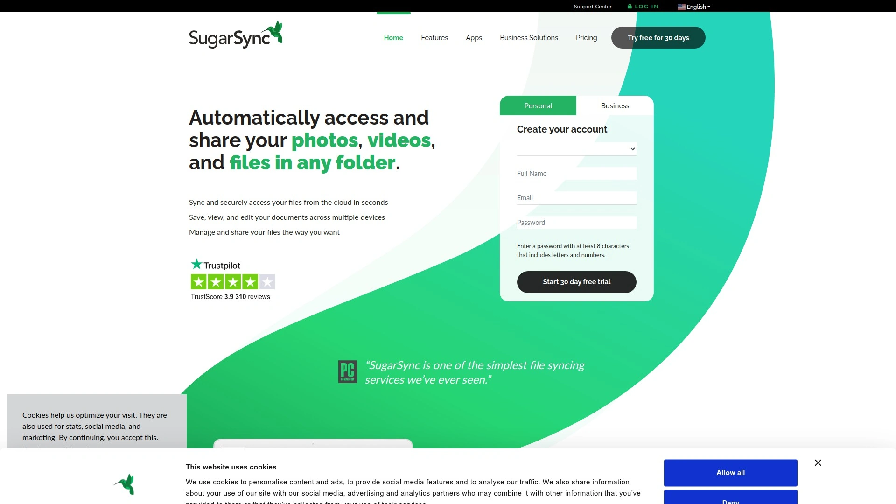

SugarSync differentiates by syncing any folder on your computer, not just specific sync folders like Dropbox. This flexibility means existing file organization structures don't need restructuring. Continuous backup protects against data loss by automatically syncing changes. File sharing happens through links with access controls. Multiple device support keeps files accessible across computers and mobile devices. The service includes file versioning for recovering previous versions. Mobile apps provide remote access to all synced content. Pricing is competitive for individuals though less compelling for teams compared to collaboration-focused platforms. Users who want backup, sync, and sharing without reorganizing existing file structures find SugarSync's approach natural.

## **[SpiderOak One](https://spideroak.com)**

Zero-knowledge encrypted backup and sync service prioritizing security over convenience features.

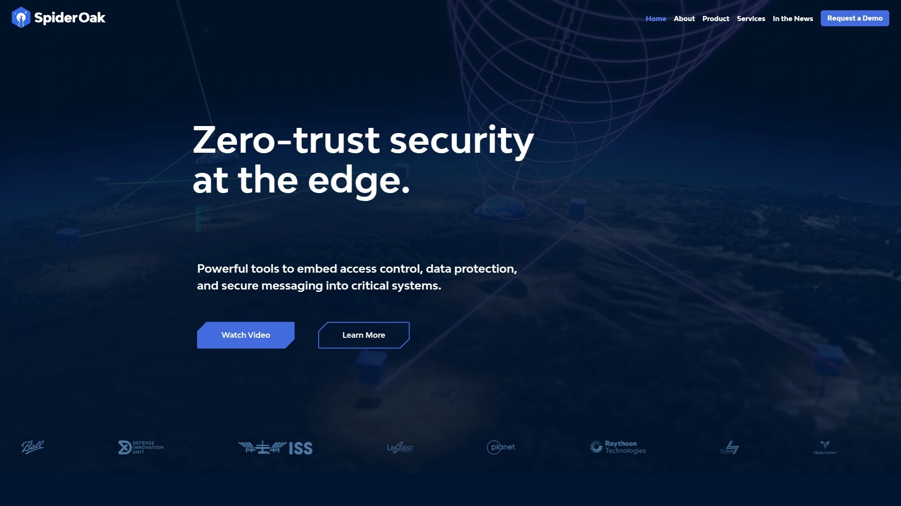

SpiderOak One focuses intensely on security with end-to-end encryption where users control encryption keys—SpiderOak cannot access your data. The zero-knowledge architecture means even the company can't decrypt files, maximizing privacy. Backup, sync, and sharing features all maintain this encryption model. The interface is functional rather than polished, reflecting the security-over-convenience philosophy. File versioning and continuous backup protect against data loss. Sharing requires more steps than simpler services due to the encryption architecture. The platform appeals to security-conscious users, journalists, activists, or anyone handling highly sensitive information where privacy matters more than ease of use. Pricing reflects the security positioning.

## **[iCloud](https://icloud.com)**

Apple's ecosystem-integrated storage providing seamless experience across Apple devices with 5GB free.

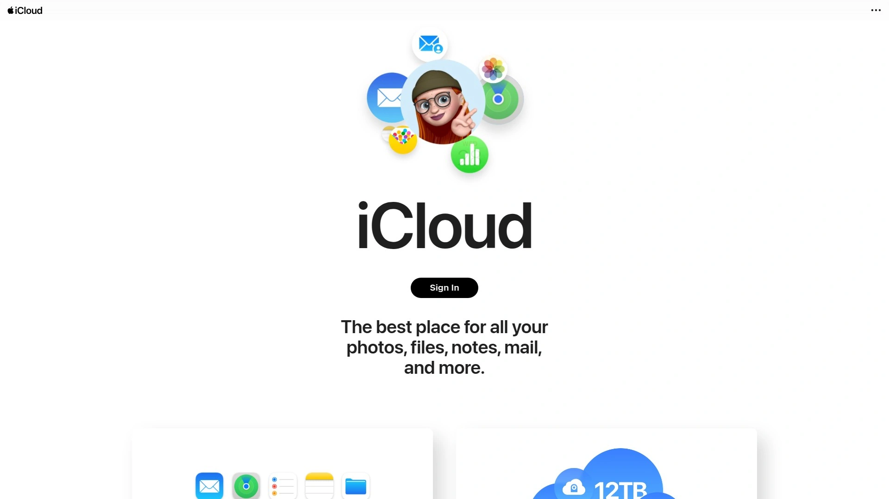

iCloud integrates deeply with Apple's ecosystem, automatically backing up photos, documents, and device data. Free accounts include 5GB storage, and paid plans expand capacity at reasonable rates. File sharing happens through iCloud Drive with link generation and permission controls. The experience is seamless on Apple devices—Mac, iPhone, iPad—with automatic sync requiring no setup. Cross-platform support exists for Windows but feels less integrated. Collaboration on iWork documents (Pages, Numbers, Keynote) works smoothly. The platform shines for users fully invested in Apple's ecosystem but becomes less compelling for mixed-device environments. Security includes two-factor authentication and encryption, though it's not zero-knowledge architecture. For Apple users wanting straightforward cloud storage without thinking about it, iCloud delivers friction-free experience.

## FAQ

**How do I choose between free and paid file transfer services?**

Free services work fine for occasional personal transfers under their size limits, but paid plans make sense when you regularly move large files, need longer storage periods, or require business features like custom branding and detailed tracking. Consider your monthly transfer volume and whether waiting in queues or watching ads wastes more money than a subscription costs.

**What security features actually matter for file transfers?**

End-to-end encryption protects files from interception during transfer, password protection prevents unauthorized access to download links, and expiration dates automatically remove files after specific periods. For sensitive business documents, look for compliance certifications matching your industry requirements—HIPAA for healthcare, GDPR for European data, SOX for financial records.

**Can these services replace internal file servers?**

Some platforms like Egnyte, ShareFile, and Box explicitly target enterprise file server replacement with hybrid deployments, granular permissions, and Active Directory integration. Simple transfer services work better for external sharing rather than replacing internal infrastructure. Consider whether you need file server functionality like mapped drives, subfolder permissions, and real-time collaboration before migrating.

## Wrapping Up

The right file transfer service depends entirely on what you're actually doing with it. **[Filemail](https://filemail.com)** hits the sweet spot for professionals and businesses that need reliable unlimited transfers without artificial restrictions—the free 5GB gets casual users started, while paid plans remove all size limits and add permanent storage for teams moving serious data regularly. The compliance certifications and custom upload pages make it work for client-facing workflows where both capacity and professionalism matter.
